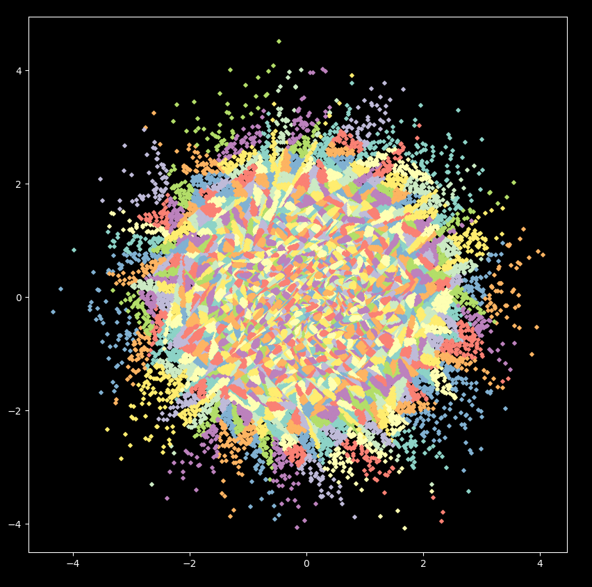
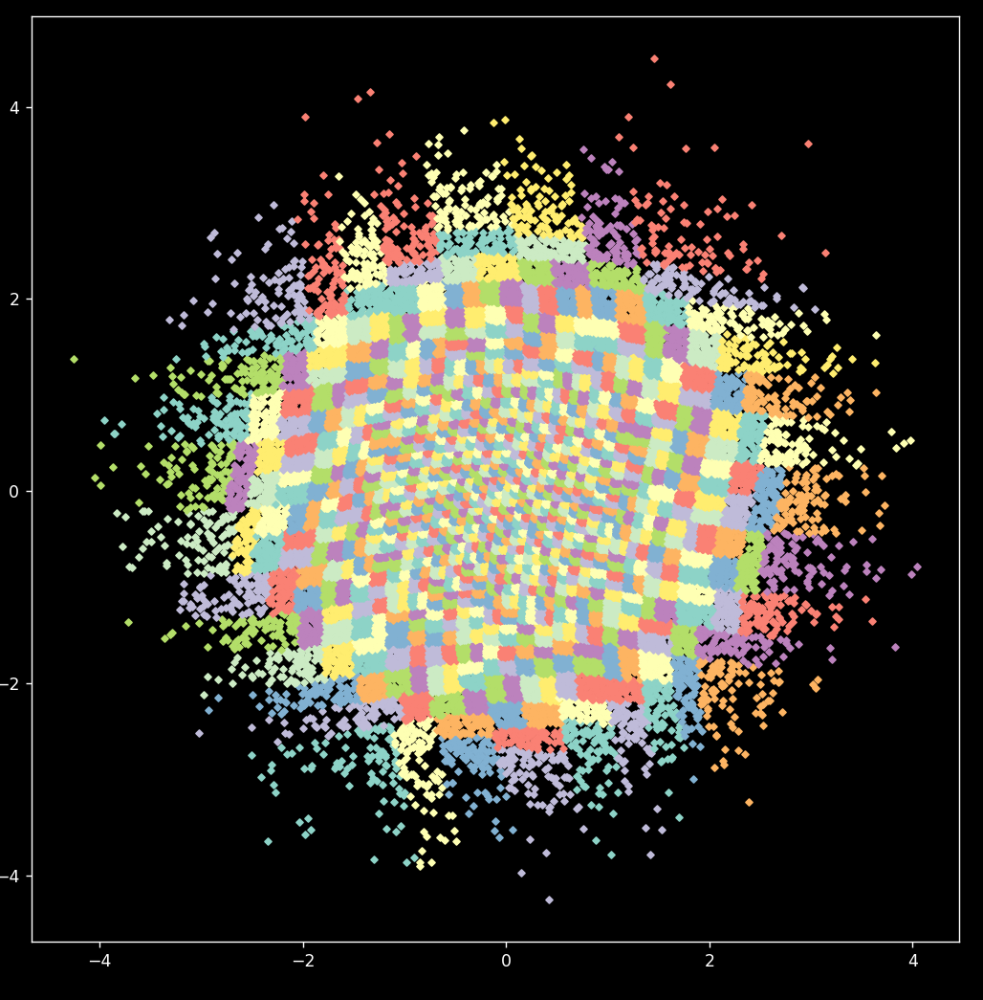
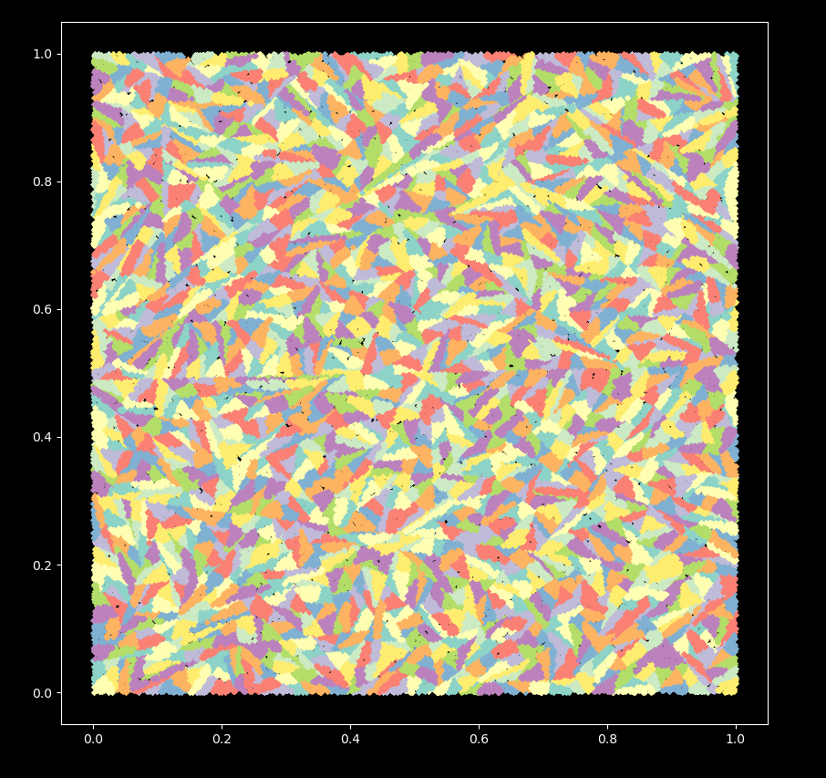
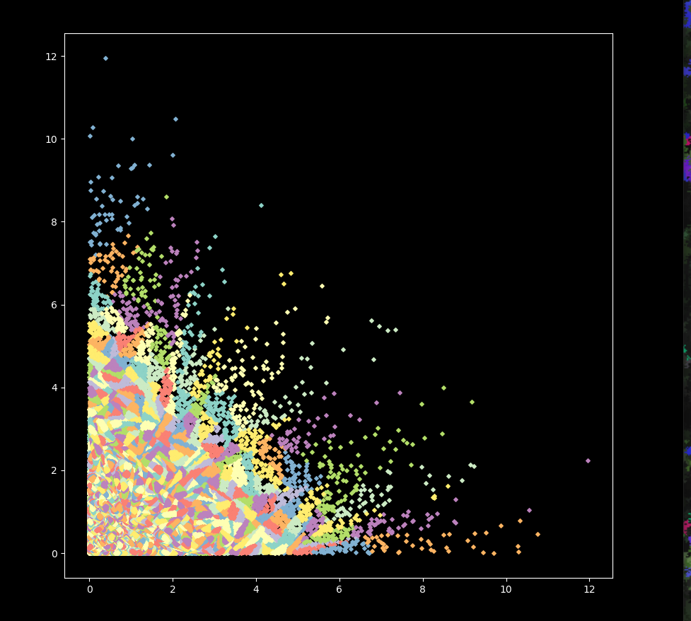
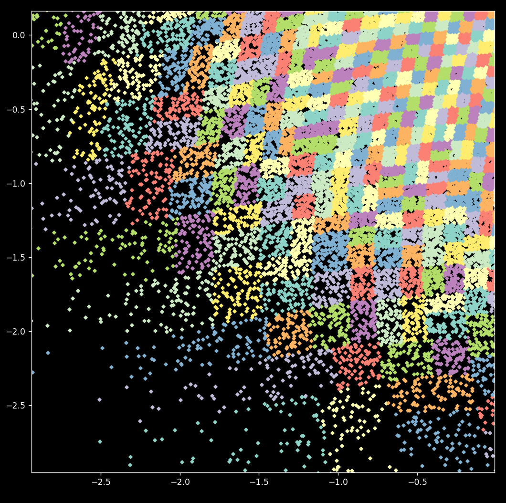
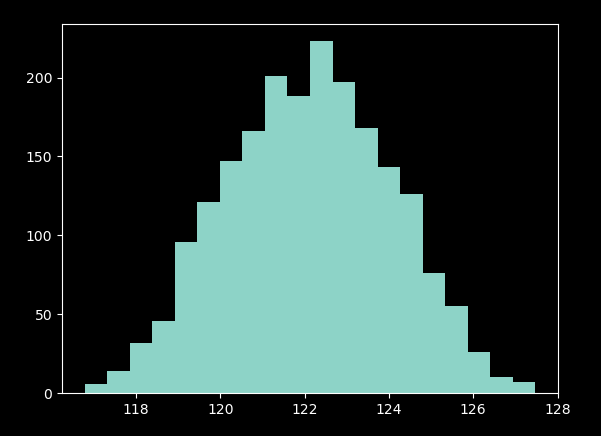
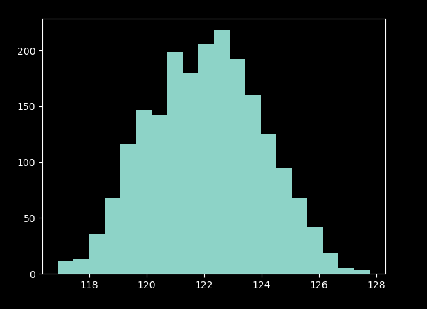
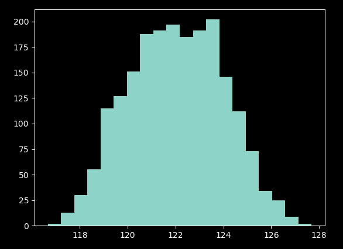
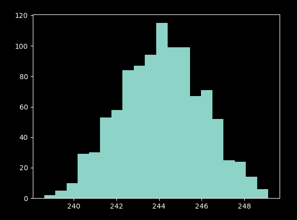

# do not readme

- es un algoritmo de clusterización que corta progresivamente el conjunto de puntos en subconjuntos, para obtener particiones balanceadas.
- el algoritmo es O(n log^2 n) según el Teorema Maestro.
- el balanceo se logra cortando en lugares precisos para el que estadísticamente debería resultar en subparticiones balanceadas.
- En términos de teoría, se puede utilizar desigualdad de concentración de Azuma-Hoeffding para demostrar que el resultado es balanceado (obteniendose cotas de concentración).

Dudas me pueden preguntar.

## Some pics

## Some histograms

as you can see, *it is balanced*
