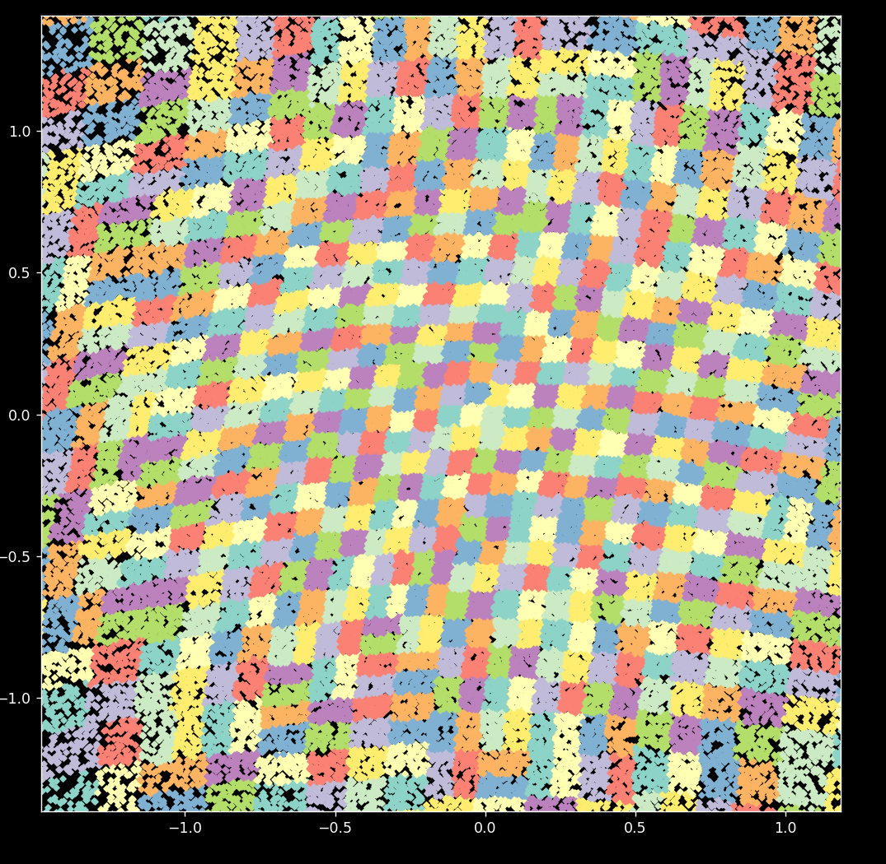

# do not readme

- el algoritmo es O(n log^2 n) según el Teorema Maestro.
- el balanceo se logra usando implícitamente la desigualdad de concentración de Azuma-Hoeffding.

Dudas me pueden preguntar.

